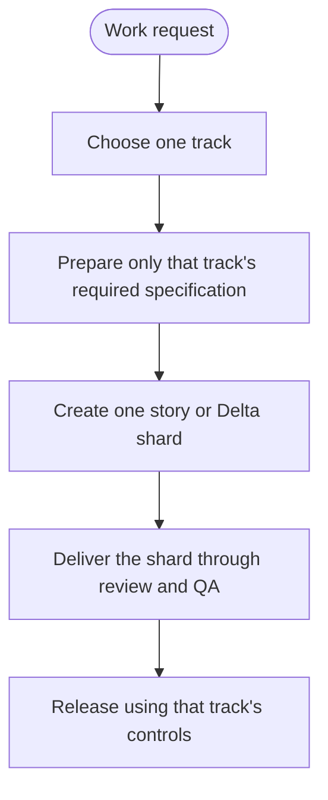

# Workflow Guide — Start Here

**Do not follow every framework path.** Choose one track, read that track's page,
then use the shared story and release guides when the page tells you to.



The Mermaid toolbar is always visible: use **+**, **−**, reset, or drag the resize handle.

## Step 1 — Choose your route

| Your work | Route |
|---|---|
| New product, major upgrade, or system-wide change | [Genesis](workflows/genesis.md) |
| Isolated feature with its own bounded scope | [Blueprint](workflows/blueprint.md) |
| Change or fix to code already shipped | [Delta](workflows/delta.md) |
| Small local-only change that will not alter production | [Flash](workflows/flash.md) |
| Unsure which one applies | [Choose a Track](workflows/choose-track.md) |

## Step 2 — Follow only that track page

The track page tells you:

1. which artifact to create;
2. which persona acts next;
3. which human gate must be approved;
4. when to enter the shared story lifecycle.

## Step 3 — Use the shared guides only when needed

- A story or Delta shard exists → [Deliver One Story](workflows/story-lifecycle.md)
- A story reaches `done` → [Release](workflows/release.md)
- Work is rejected, failing, blocked, stale, or rolled back → [Recovery](workflows/recovery.md)

## Find the next step from current status

| Current status | Do this now |
|---|---|
| `draft` | Run DoR; fix every reported shard problem |
| `ready` | Orchestrator verifies routing and assigns one owner |
| `in_progress` | Implement only the declared outputs |
| `review` | Code review and human Gate 3 |
| `qa` | Run the track-required test suite |
| `blocked` | Stop automation and open the Recovery guide |
| `stale` | Update against the current contract, then return to `draft` |
| `done` | Open the Release guide |

## The only commands needed for navigation

```bash
node scripts/okf-conformance.mjs
node scripts/dor-check.mjs <shard-path>
node scripts/contract-guard.mjs
```

For normative details, use the
[canonical specification](../IUVARE_AI_SDLC_v3.md). The focused pages are a
navigation aid; specification and policy remain authoritative.
