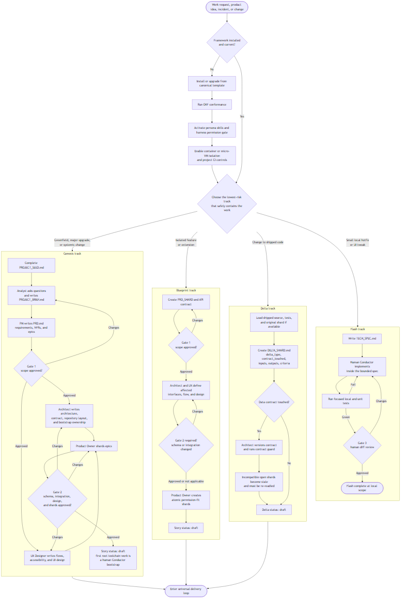
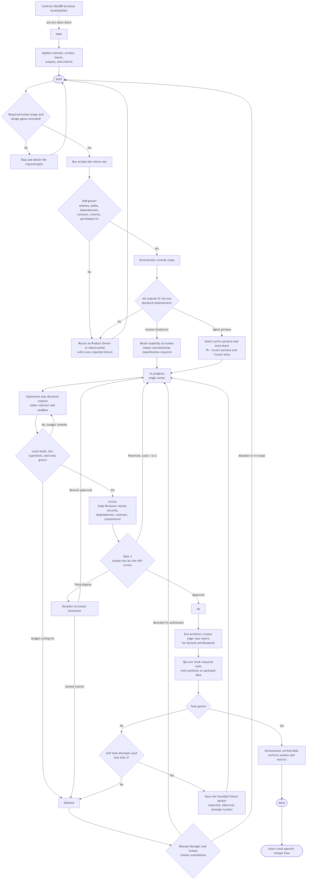
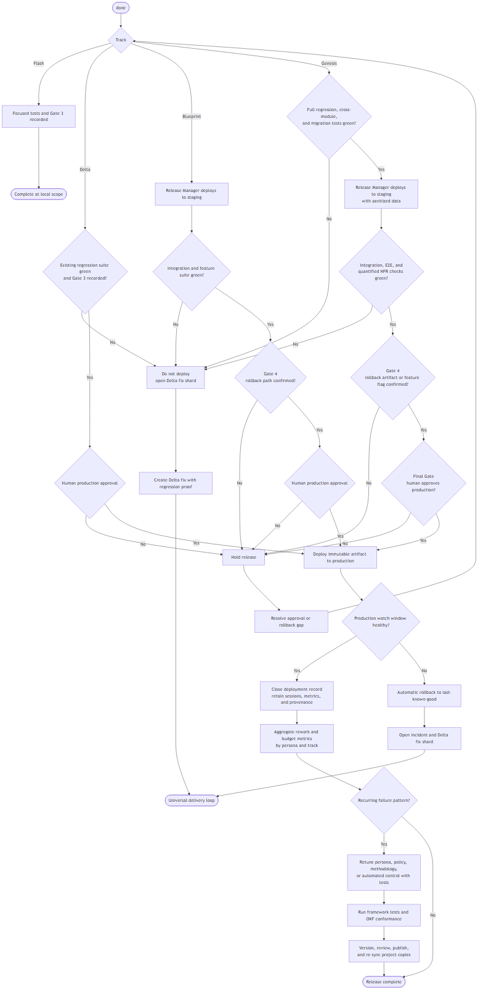

# Complete Iuvare AI SDLC Workflow

Use this page as the operational map for deciding **what happens next**. The
canonical specification remains [`IUVARE_AI_SDLC_v3.md`](../IUVARE_AI_SDLC_v3.md);
when this navigation map and the specification disagree, the specification and
active policies win.

## Legend

- **Conductor** — human micro-steering work inside the harness.
- **Orchestrator** — human or agent coordinating state, ownership, gates, and
  audit records.
- **Gate** — human-owned approval; an agent cannot waive it.
- **DoR** — machine-checked structural startability plus Gate-2 semantic review.
- **DoD** — tests green, Gate 3 recorded, artifacts merged, and audit data saved.

> **VS Code preview:** each section displays a committed PNG, so no Mermaid
> extension is required. The editable Mermaid source is stored separately as
> `.mmd` to prevent preview-renderer conflicts. VS Code 1.121+ supports Mermaid
> natively; do not install the deprecated `bierner.markdown-mermaid` extension.

---

## 1. Master workflow: request → track → ready work



[Open Mermaid source](assets/complete-workflow/track-selection.mmd)

> Flash deliberately stops at local scope in the current trust-threshold model.
> If a “small” change must alter shipped production code, classify it as **Delta**
> so regression and production controls apply.

---

## 2. Universal shard delivery and state machine

This loop applies to Genesis and Blueprint stories and Delta shards.



[Open Mermaid source](assets/complete-workflow/delivery-state-machine.mmd)

### State ownership rule

Only the **Orchestrator** records status transitions. Reviewer and QA verdicts
drive transitions, but they do not directly rewrite the shard. `owner` changes
with workflow custody; immutable `implementer` remains the Phase-3 write
authority.

---

## 3. Release, promotion, rollback, and incident flow



[Open Mermaid source](assets/complete-workflow/release-recovery.mmd)

---

## 4. “What should I do next?” lookup

| Current condition | Next action | Primary authority |
|---|---|---|
| Framework not installed/current | Install or re-sync, run conformance, activate harness integration, enable OS isolation | Human Conductor |
| Greenfield with only an idea | Fill `PROJECT_SEED.md`, then load Analyst | Human → Analyst |
| `PROJECT_SEED.md` complete | Ask clarifying questions and produce `PROJECT_BRIEF.md` | Analyst |
| Brief complete | Produce quantified PRD and epics | PM |
| PRD complete | Obtain Gate 1 scope approval | Human |
| Gate 1 approved | Define architecture, contract, repository/bootstrap ownership, and UX | Architect + UX Designer |
| Architecture/UX complete | Create atomic, source-backed, permission-fit shards | Product Owner |
| Shards/design ready | Obtain Gate 2 where required | Human |
| Shard is `draft` | Run `node scripts/dor-check.mjs <shard>` | Product Owner + Orchestrator |
| Shard is `ready` | Verify routing, select one owner, move to `in_progress` | Orchestrator |
| `implementer: conductor` | Human performs the explicitly declared outputs | Human Conductor |
| Shard is `in_progress` | Implement only outputs and run local quality checks | Developer/declared implementer |
| Shard is `review` | Security/dependency review and Gate 3 | Code Reviewer + Human |
| Shard is `qa` | Edge-case matrix, required suite, bounded self-heal | Test Architect + QA |
| Shard is `blocked` | Stop automation; inspect full attempt history and choose remediation | Release Manager + Human |
| Shard is `stale` | Update it against the new contract and return it to `draft` | Product Owner + Orchestrator |
| Shard is `done` | Follow the track-specific promotion path | Release Manager + Human |
| Production regression | Auto-rollback, open incident, create Delta `fix` | Release Manager + Human |
| Repeated rework pattern | Change the framework with tests, version it, then re-sync projects | Human framework maintainers |

## Operational commands

```bash
# Validate the installed knowledge bundle
node scripts/okf-conformance.mjs

# Pi: regenerate persona skills and install the permission gate
node scripts/activate-pi-skills.mjs

# Check one story or Delta before ready/assignment
node scripts/dor-check.mjs .iuvareai/stories/001.001.example.md

# Verify contract compatibility; default mode never mutates
node scripts/contract-guard.mjs

# Apply automatic stale transitions, then review and commit the changes
node scripts/contract-guard.mjs --write
```

## Non-negotiable stop conditions

Stop and escalate instead of guessing when:

- a required human gate is missing;
- no one implementer can write every expected output;
- a root write is assigned to an agent persona;
- acceptance criteria are semantically vague or outputs cannot satisfy them;
- the data-contract major is incompatible;
- credentials, real PII, or production access would enter agent context;
- the self-heal limit, review-cycle limit, or budget ceiling is exhausted;
- rollback cannot be demonstrated before a production promotion.
