# Blueprint Workflow

**Use when:** the feature is bounded but needs explicit interfaces, design, and
staging verification.

[Open zoomable view](assets/blueprint.svg) · [Mermaid source](assets/blueprint.mmd)

## Do these steps in order

| # | Action | Owner | Exit condition |
|---:|---|---|---|
| 1 | Define feature scope and API boundary | PM / Human | PRD shard + API contract |
| 2 | Approve scope | Human | **Gate 1 approved** |
| 3 | Define affected architecture, integration, and UX | Architect + UX | Bounded design complete |
| 4 | Create atomic permission-fit stories | Product Owner | Stories in `draft` |
| 5 | Review schema/integration if changed | Human | **Gate 2 approved or not applicable** |
| 6 | Run DoR on the first dependency-clean story | Orchestrator | Story can become `ready` |

Do not turn an isolated feature into a miniature Genesis project. Read and
produce only the artifacts needed by the affected boundary.

**Next:** [Deliver One Story](story-lifecycle.md)
