# Choose a Track

Answer the questions in order and stop at the first match.

[Open zoomable view](assets/choose-track.svg) · [Mermaid source](assets/choose-track.mmd)

| Track | Use it when | Required preparation | Next guide |
|---|---|---|---|
| **Genesis** | Greenfield, major upgrade, systemic redesign | Full brief, PRD, architecture, contract, UX, stories | [Genesis](genesis.md) |
| **Delta** | Existing shipped code or behavior changes | Delta shard + existing regression context | [Delta](delta.md) |
| **Blueprint** | Isolated feature with bounded integration | PRD shard, API contract, affected design | [Blueprint](blueprint.md) |
| **Flash** | Small local-only change, no production promotion | `TECH_SPEC.md` | [Flash](flash.md) |

## If uncertain

Choose the **heavier** adjacent track. In particular, if a small change modifies
shipped production code, use **Delta**, not Flash.

[Back to Start Here](../complete-workflow.md)
