# Delta Workflow

**Use when:** changing, fixing, or refactoring shipped code.

[Open zoomable view](assets/delta.svg) · [Mermaid source](assets/delta.mmd)

## Do these steps in order

| # | Action | Owner | Exit condition |
|---:|---|---|---|
| 1 | Load existing source, tests, and original shard | Orchestrator | Small context packet ready |
| 2 | Create the Delta shard | Human / Orchestrator | `delta_type`, inputs, outputs, criteria set |
| 3 | Include every existing modified source/test file in `inputs` | Shard author | Source-backed context |
| 4 | If the contract changes, version it and run contract guard | Architect + Orchestrator | Incompatible open shards are `stale` |
| 5 | Run DoR | Orchestrator | Delta becomes `ready` |
| 6 | Deliver and prove regression safety | Developer + QA | Existing suite remains green |

Choose `delta_type` deliberately:

- `behavior` — intended behavior change; update tests.
- `fix` — add a regression test proving the bug.
- `refactor` — no behavior change; coverage must not drop.

**Next:** [Deliver One Story](story-lifecycle.md), then [Release](release.md)
