# Flash Workflow

**Use when:** the change is small, local, and will not be promoted to production.
If it modifies shipped production code, use [Delta](delta.md).

[Open scalable SVG](assets/flash.svg) · [Mermaid source](assets/flash.mmd)

## Five actions only

1. Write a short `TECH_SPEC.md` stating the exact change and test.
2. Human Conductor implements inside that boundary.
3. Run focused local/unit tests.
4. Human reviews the diff at **Gate 3**.
5. Stop at local completion.

Flash has no DoR ceremony, staging, or production promotion. Do not add those
steps—reclassify the work instead.

**Next:** return to [Start Here](../complete-workflow.md) for another request.
