# Genesis Workflow

**Use when:** building a new product, performing a major upgrade, or changing the
system as a whole.

[Open scalable SVG](assets/genesis.svg) · [Mermaid source](assets/genesis.mmd)

## Do these steps in order

| # | Action | Owner | Output / exit condition |
|---:|---|---|---|
| 1 | Fill the project seed | Human | `PROJECT_SEED.md` |
| 2 | Clarify vision, users, boundaries, and risks | Analyst | `PROJECT_BRIEF.md` |
| 3 | Define requirements, NFRs, and epics | PM | `PRD.md` |
| 4 | Approve scope | Human | **Gate 1 approved** |
| 5 | Define architecture, contract, repository layout, bootstrap ownership, and UX | Architect + UX | Architecture, contract, UI design |
| 6 | Split work into atomic permission-fit stories | Product Owner | Stories in `draft` |
| 7 | Approve schema, integration, design, and shards | Human | **Gate 2 approved** |
| 8 | Start the first eligible story | Orchestrator | Enter shared story lifecycle |

## Greenfield bootstrap rule

Before application code:

- Architect identifies mandatory root toolchain files.
- Product Owner creates a separate `implementer: conductor` Genesis story with
  `bootstrap: true` and a reason.
- Human Conductor completes it through review and QA.
- Developer stories remain blocked until that dependency is `done`.

## Exit checklist

Proceed only when Gate 1 and Gate 2 are recorded, the contract is versioned, and
at least one dependency-clean shard can pass DoR.

**Next:** [Deliver One Story](story-lifecycle.md)
