# Recovery

Identify where the failure occurred, follow only that row, then return to the
normal lifecycle.

[Open scalable SVG](assets/recovery.svg) · [Mermaid source](assets/recovery.mmd)

| Failure | Immediate action | Resume when |
|---|---|---|
| DoR | Fix missing/invalid shard metadata, dependencies, inputs, outputs, or permissions | DoR is green; return `draft → ready` |
| Review | Developer applies specific findings | Gate 3 approves; max two cycles before human escalation |
| QA | Send one bounded failure packet to Developer | Tests pass within three attempts |
| Self-heal/budget exhausted | Set `blocked`; stop autonomous retries | Human/Release Manager authorizes remediation |
| Contract MAJOR mismatch | Set affected open shards `stale` | Shard is updated and re-readied against current contract |
| Staging failure | Do not promote; create Delta `fix` | Fix completes normal lifecycle |
| Production regression | Auto-rollback to last-known-good; open incident and Delta `fix` | Regression proof and release gates pass |

Never disable a failing control to make the pipeline move. A blocked pipeline is
a diagnostic signal.

**Resume:** [Deliver One Story](story-lifecycle.md) or [Release](release.md)
