# Release

Start here only after the story is `done`.

[Open zoomable view](assets/release.svg) · [Mermaid source](assets/release.mmd)

| Track | Required path |
|---|---|
| **Flash** | Focused tests + Gate 3; stop locally |
| **Delta** | Existing regression suite green → human production approval |
| **Blueprint** | Staging/integration green → Gate 4 rollback confirmed → human production approval |
| **Genesis** | Full regression/migrations → staging/E2E/NFRs → Gate 4 → Final Gate |

## Release Manager checklist

- Deploy the reviewed immutable artifact, not a workspace rebuild.
- Production credentials remain unavailable to agents.
- Confirm prior artifact or feature-flag rollback before required Gate 4.
- Record deployment result and watch window.
- On production regression, rollback first; do not live-debug production.

**If release fails:** [Recovery](recovery.md)  
**If release succeeds:** archive the deployment record and close the work.
