# Deliver One Story

Focus on the happy path first. Open [Recovery](recovery.md) only when something
fails.

[Open scalable SVG](assets/story-lifecycle.svg) · [Mermaid source](assets/story-lifecycle.mmd)

| State | What happens now | Who moves it forward |
|---|---|---|
| `draft` | Run DoR and fix the shard—not code | Product Owner + Orchestrator |
| `ready` | Verify output/implementer fit and assign one owner | Orchestrator |
| `in_progress` | Implement only declared outputs; run local quality checks | Declared implementer |
| `review` | Security/dependency review and human Gate 3 | Code Reviewer + Human |
| `qa` | Run the track-required suite; use bounded self-heal if needed | Test Architect + QA |
| `done` | Verify DoD, archive session/metrics, then release | Orchestrator |

## Three rules that prevent most mistakes

1. Only the Orchestrator records status transitions.
2. `owner` may change; immutable `implementer` defines Phase-3 write authority.
3. Never start code while DoR, a dependency, or a required human gate is red.

## If the happy path breaks

| Problem | Next action |
|---|---|
| DoR fails | Return to `draft` and fix the shard |
| Review rejects | Rework; maximum two review cycles |
| QA fails | Bounded self-heal; maximum three attempts |
| Contract major changes | Move affected open shard to `stale` |
| Budget or retry limit is exhausted | Move to `blocked` and stop automation |

**Next when green:** [Release](release.md)  
**Next when not green:** [Recovery](recovery.md)
